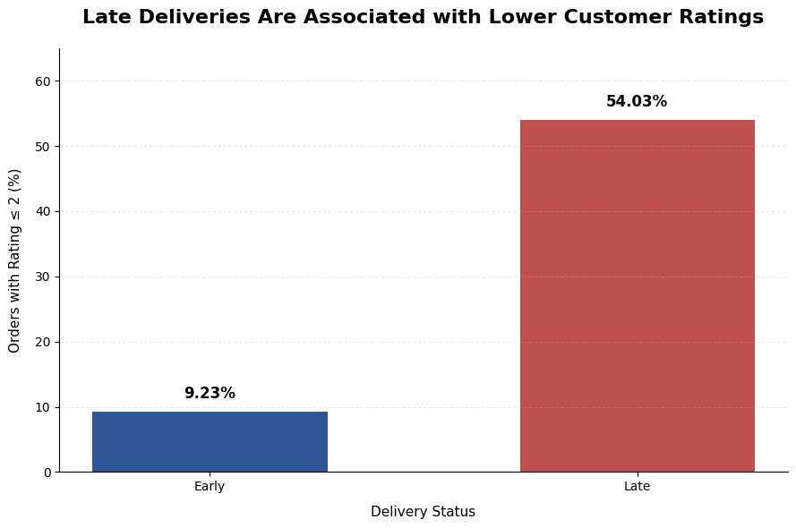

# E-Commerce Delivery Performance & Customer Satisfaction Analysis

## 📌 Project Overview

This project analyzes e-commerce delivery performance and customer satisfaction using the Brazilian E-Commerce Public Dataset by Olist.

The analysis focuses on understanding delivery delays, customer review patterns, and product categories with relatively high delivery delay rates.

### Business Question

> **What factors are associated with late deliveries and poor customer reviews?**

The goal is to transform raw e-commerce data into actionable business insights that can support operational decision-making and improve customer experience.

---

## 🎯 Objectives

This analysis aims to:

- Measure overall delivery performance and late delivery rate.
- Examine the relationship between delivery status and customer satisfaction.
- Identify product categories with relatively high late delivery rates.
- Identify patterns associated with low customer ratings.
- Provide actionable recommendations for improving delivery reliability and customer experience.

---

## 📊 Dataset

**Source:** Brazilian E-Commerce Public Dataset by Olist

The dataset contains approximately 100,000 orders from a Brazilian e-commerce platform between 2016 and 2018.

The analysis primarily uses the following datasets:

- Orders
- Order Reviews
- Order Items
- Products

The original dataset is available on Kaggle.

---

## 🛠️ Tools & Technologies

- **Python**
- **Pandas** – Data manipulation and analysis
- **NumPy** – Numerical computation
- **Matplotlib** – Data visualization
- **Google Colab** – Development environment
- **GitHub** – Project documentation and version control

---

## 🔎 Analysis Approach

The analysis follows these main stages:

### 1. Data Loading

- Load the relevant Olist datasets.
- Inspect dataset structure, data types, and missing values.

### 2. Data Cleaning

- Convert date columns into datetime format.
- Identify and evaluate missing values.
- Filter delivered orders with available actual delivery dates.
- Handle missing product categories for category-level analysis.

### 3. Delivery Performance Analysis

- Calculate delivery delay in days.
- Classify orders as Early or Late.
- Calculate the overall late delivery rate.

### 4. Customer Satisfaction Analysis

- Analyze customer review scores.
- Compare review scores between Early and Late deliveries.
- Measure the proportion of low ratings (≤2).

### 5. Product Category Analysis

- Calculate late delivery rates by product category.
- Compare category-level delivery performance and average review scores.
- Apply a minimum order threshold to reduce the influence of categories with very small sample sizes.

---

## 📈 Key Findings

### 1. Overall Delivery Performance

Among **96,470 delivered orders** with available actual delivery dates:

> **8.11% of orders were delivered late.**

This indicates that while the majority of orders were delivered before the estimated delivery date, a measurable proportion experienced delivery delays.

### 2. Late Deliveries and Customer Dissatisfaction

A substantial difference was observed between early and late deliveries.

| Delivery Status | Low Rating (≤2) |
|---|---:|
| Early | 9.23% |
| Late | 54.03% |

More than half of late orders received a low customer rating, compared with only 9.23% of early orders.

This represents approximately a **5.9× higher proportion of low ratings among late orders**.

### 📊 Key Visualization



*Late orders show a substantially higher proportion of low customer ratings compared with early orders.*

### 3. Product Categories with Higher Late Delivery Rates

Among categories with at least 100 orders, several categories showed relatively high late delivery rates:

| Product Category | Late Delivery Rate |
|---|---:|
| fashion_underwear_e_moda_praia | 12.93% |
| audio | 12.75% |
| livros_tecnicos | 10.98% |
| casa_conforto | 10.51% |

These categories can be considered areas for further operational investigation.

---

## 💡 Business Insights

The analysis indicates that **delivery reliability is strongly associated with customer satisfaction at the order level**.

Late orders had substantially higher proportions of low customer ratings compared with early orders.

However, the relationship between category-level late delivery rates and average review scores was relatively weak, with a correlation of **-0.14**.

This suggests that delivery delays are an important customer experience signal, while other factors may also influence customer satisfaction.

> **Important:** This analysis identifies associations rather than causal relationships.

---

## 🚀 Business Recommendations

### 1. Monitor At-Risk Orders

Implement operational monitoring to identify orders that are approaching their estimated delivery date but have not yet reached the expected delivery stage.

This would allow the operations team to intervene before an order becomes significantly delayed.

### 2. Investigate High-Risk Product Categories

Categories with relatively high late delivery rates, such as **audio** and **casa_conforto**, can be prioritized for further investigation.

Potential factors to investigate include:

- Order processing time
- Seller performance
- Logistics partner performance
- Shipping distance
- Customer location
- Regional delivery patterns

### 3. Develop Delivery Performance KPIs

Track operational KPIs such as:

- Late Delivery Rate
- Average Delivery Delay
- On-Time Delivery Rate
- Low Rating Rate
- Late Delivery Rate by Product Category

These metrics can be incorporated into a Business Intelligence dashboard for continuous monitoring.

### 4. Improve Customer Recovery

For delayed orders, companies can provide proactive communication, updated delivery estimates, and appropriate customer recovery actions to reduce the negative impact on customer experience.

---

## 📁 Project Structure

```text
ecommerce-delivery-analysis/
│
├── README.md
│
└── ecommerce_delivery_customer_satisfaction_analysis.ipynb
```

---

## 👤 Author

**Tria Yunanni**

**Bachelor of Data Science | Business Analytics | Data Analysis**

Interested in transforming data into actionable business insights and supporting data-driven decision-making.

---

## 📓 Notebook

The complete analysis, data preparation, visualizations, and findings are available in the Jupyter Notebook included in this repository.
